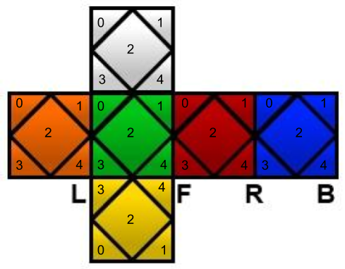

# gym-skewb

An OpenAI environment for the Skewb and an implementation of Deep Reinforcement Learning to solve this tricky puzzle.

## Installation

Install the [OpenAI gym](https://gym.openai.com/docs/).

Then install this package via

```
pip install -e .
```

## Usage

```
import gym
import gym_skewb

env = gym.make('Skewb-v0')
env.reset()
for _ in range(3):
    env.render()
    observation, reward, done, info = env.step(env.action_space.sample()) 
```

## Examples and Training
Check ``` examples/baselines ```
for training with baselines.

Check ```examples/stablebaselines```
for training with stable baselines. 

Currently, the model has reached a 70% solve rate for three-move scrambles after ~2 hours of training with Deep Reinforcement Learning. To see training and run solves on the model, check the implementation of the Deep Q-Network in the respective folders.

## Skewb

The Skewb representation is implemented in ```skewb.py```

Basic tests for correct implementation of the Skewb are in ```test.py```

### Skewb Representation
The Skewb is represented as six arrays of colors. Each side has five pieces, and the following image describes the index in each array for each piece.



The four unique turns (R, L, U, F) are implemented; all others are derivations of these four. 

Currently, the episode ends at 40 moves, meaning that any further moves (which may lead to solves) will not be considered. For more complicated scrambles, 40 moves may not be sufficient, and this limit should be extended.
